<!-- ═══════════════════════════════════════════════════════════════
     PURSION // OPERATOR FILE — bruteon edition
     Palette: cream #EDE6DA · ink #1A1512 · cinnabar #C8321E · mustard #E8B730
     Custom panels live in /assets — edit generate_assets.py and re-run it.
     ═══════════════════════════════════════════════════════════════ -->

  

  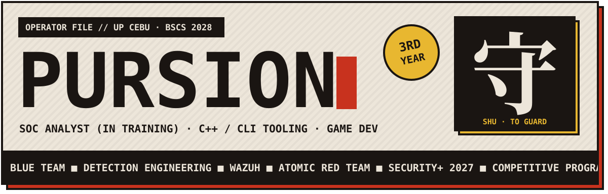

  

  

  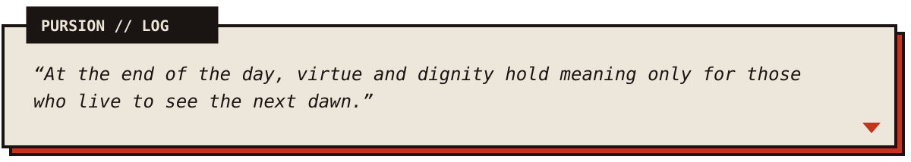

 

<!-- ─────────────────────────── 01 ─────────────────────────── -->

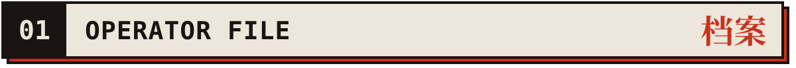

  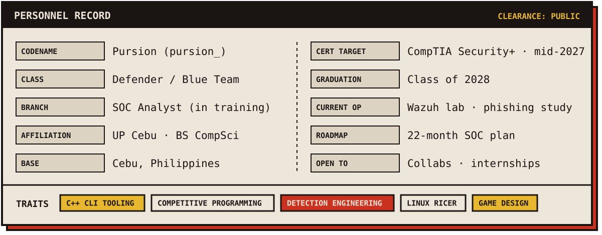

  
  
  
  
  
  <!-- Fill in and uncomment:
  
  
  
  -->

  
<b><code>🔑 CLASSIFIED — ALTERNATE ACCOUNT & PRIVATE REPOS</code></b>

   
  

    This account is a curated selection. Larger projects, private repositories (including Discord bot backends),
    game prototypes, and anything touching tokens or credentials live on an alternate account.
      
    <b>Request access by email</b> — for collaborations, internship or employment inquiries, and specific project discussions.
  

 

<!-- ─────────────────────────── 02 ─────────────────────────── -->

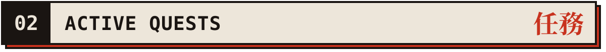

<!-- Wrap any card in <a href="REPO_URL">…</a> once its repo is public -->

  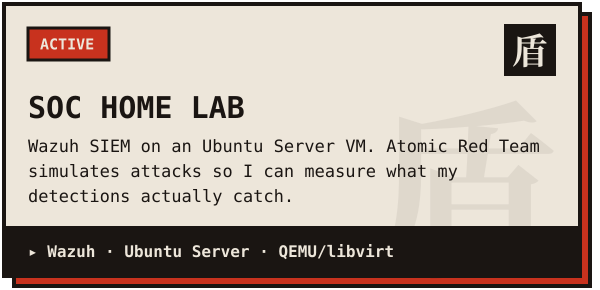
  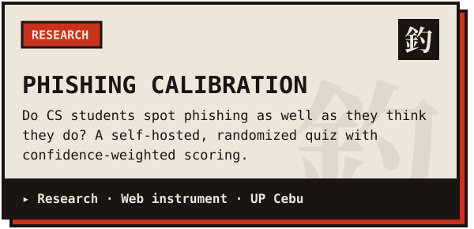

  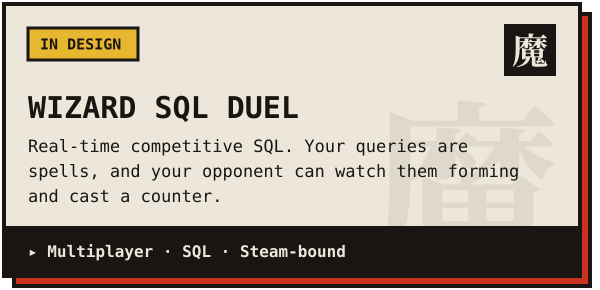
  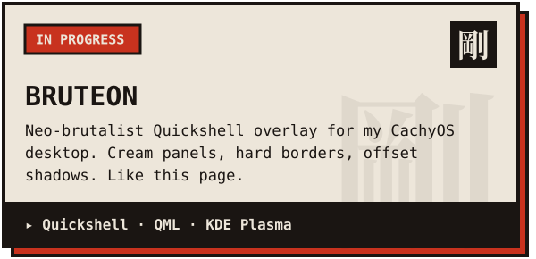

 

<!-- ─────────────────────────── 03 ─────────────────────────── -->

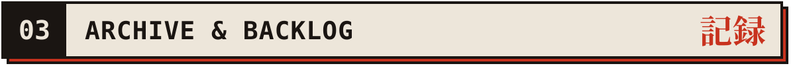

  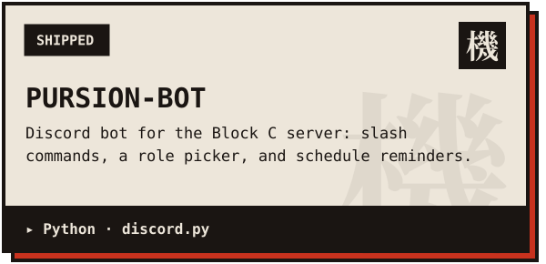
  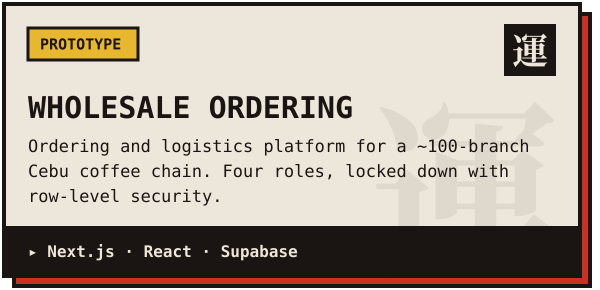

  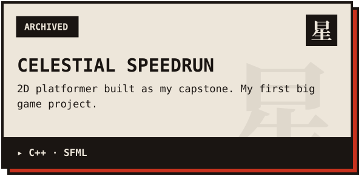
  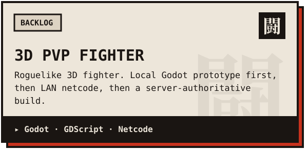

 

<!-- ─────────────────────────── 04 ─────────────────────────── -->

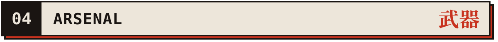

<b><code>▸ LANGUAGES</code></b> 

  <b><code>▸ SECURITY & SYSTEMS</code></b> 

  <b><code>▸ WEB & BACKEND</code></b> 

  <b><code>▸ TOOLS & DESKTOP</code></b> 

  

  
<b><code>🖥️ LOADOUT — DAILY DRIVER</code></b>

   

  | Slot | Gear |
  |:--|:--|
  | **Machine** | ASUS ROG Zephyrus G14 · Ryzen AI 9 HX 370 · RTX 5060 · 32GB |
  | **OS** | CachyOS + KDE Plasma · btrfs · Limine |
  | **Rice** | Soft-dark Quickshell setup — hairline borders, ambient depth (retired: *Wuling*, an ink-and-cinnabar GlazeWM rice) |
  | **Brain** | Obsidian vault + Dataview — roadmap, coursework, lab notes |

 

<!-- ─────────────────────────── 05 ─────────────────────────── -->

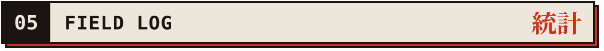

<!-- stats / langs / activity are built by .github/workflows/profile-cards.yml into the `output` branch -->

  
  

  
  

  

  

  
  

 

<!-- ─────────────────────────── 06 ─────────────────────────── -->

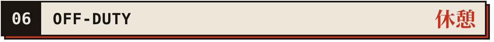

  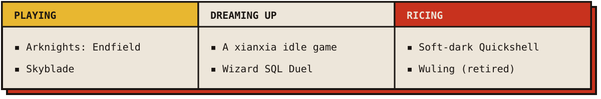

 

  

  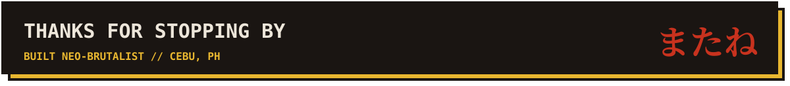

